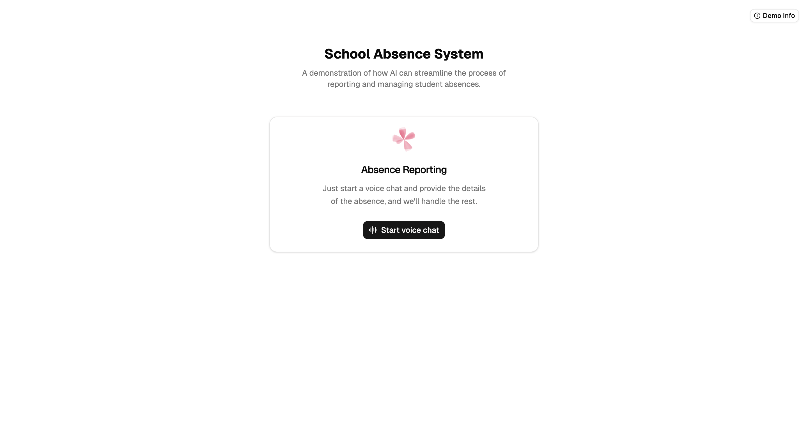
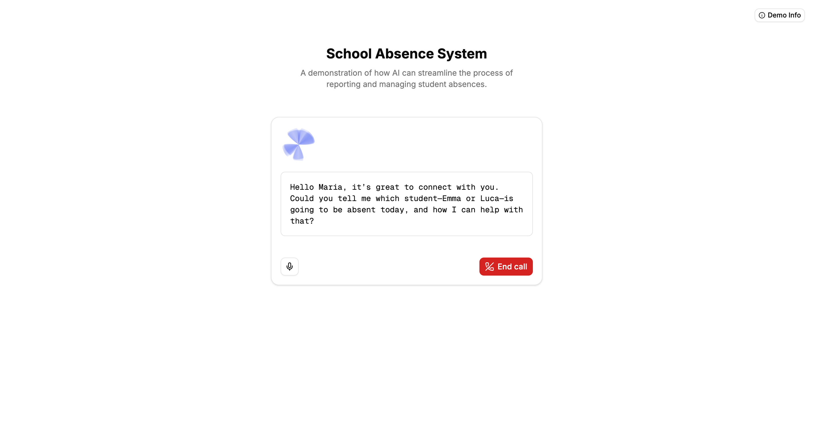
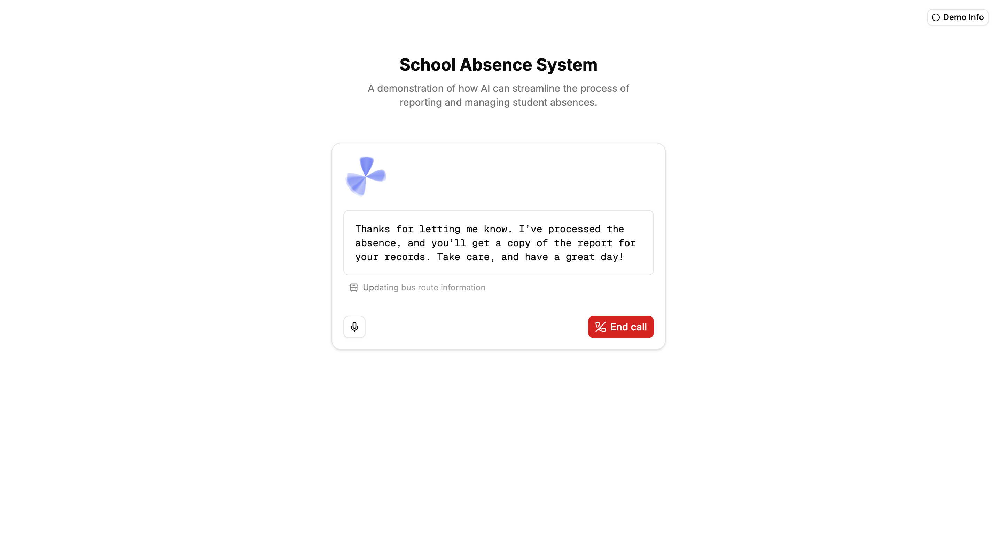
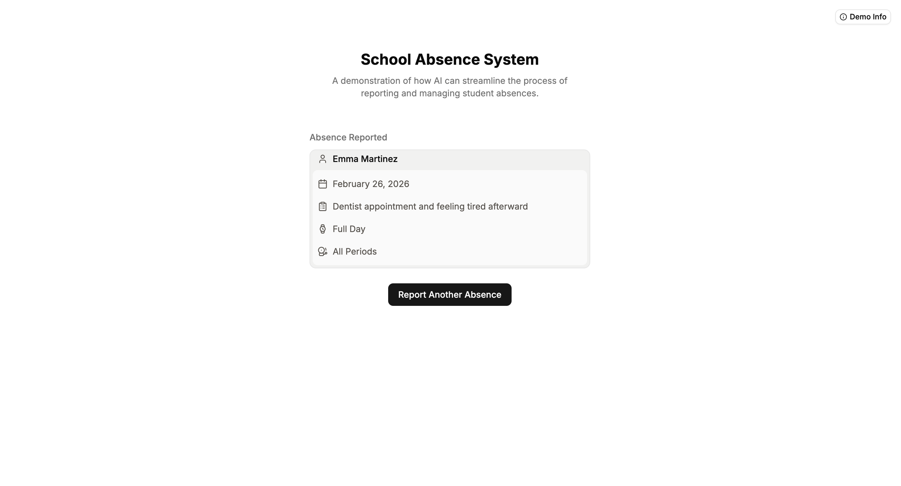

# Absence AI

<!-- <p align="center">
   
</p> -->


## The Issue

Reporting a single student absence often triggers a chain of manual processes — notifying teachers, updating attendance records, alerting the nurse's office — which can take up to 15 minutes of staff time per student. For schools managing hundreds of students, this adds up quickly and pulls staff away from more pressing tasks.

## This Solution

Absence AI demonstrates how a Realtime LLM voice agent can handle the entire absence reporting workflow automatically. Parents call in, speak naturally, and the system collects, confirms, and processes the absence — reducing staff handling time to virtually zero.

## Features

- **Realtime voice intake**: Parents report absences in a natural voice conversation — no forms, no hold times.
- **Smart absence collection**: Handles single or multiple students in one call, with per-student reasons.
- **Illness triage for the nurse's office**: When a student is absent due to illness, the agent follows up to collect relevant health details — fever, vomiting, positive COVID/flu tests, and any other symptoms — and routes a structured note to the nurse.
- **Automated confirmation**: The agent verifies all details with the parent before submitting.
- **Structured record generation**: Produces clean, typed absence records without manual data entry.
- **Minimal staff intervention**: Designed to test workflows that reduce staff time dramatically.

## Screenshots






## Prerequisites

Before you begin, make sure you have the following:

- **Node.js** (v18 or newer) and **npm** installed. [Download Node.js](https://nodejs.org/)
- An **OpenAI API key** ([get one here](https://platform.openai.com/account/api-keys))

## Quick Start

1. Clone the repo:

```bash
   git clone https://github.com/internetdrew/absence-ai.git
   cd absence-ai
```

2. Install dependencies:

```bash
   npm install
```

3. Create your local environment file:

```bash
   cp .env.example .env.local
```

Then edit `.env.local` and add your OpenAI API key.

4. Start the development server:

```bash
   npm run dev
```

## Tech Stack

- **Frontend**: React + Tailwind CSS + shadcn/ui
- **Realtime API**: OpenAI Realtime (WebRTC)
- **Voice handling**: Browser microphone + WebRTC peer connection
- **Backend**: Node.js Express server for session handling

## Project Structure

## License

MIT License

## Agent Notes

See AGENTS.md for repo-specific guidance and Realtime/WebRTC conventions.
